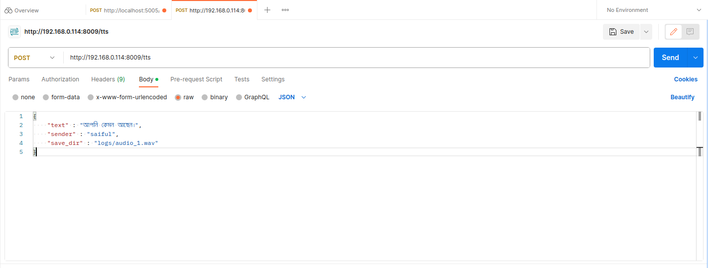

# Bangla TTS
The Bangla TTS was traning mono(male) speaker using Vit tts model. The paper is ViT-TTS: Visual Text-to-Speech with Scalable Diffusion Transformer, we used the coqui-ai🐸-toolkit for Bangla Text-to-Speech training as well as inference.

__N.B : This pipeline only for inference as well as end point API testing purposes.__

# Requiremnts
Create Enviroments
```
conda create -n bn_tts python==3.8
conda activate bn_tts
```
Install require modules

```
pip install -r requirements.txt
```

# Single Test[Inference]

For the single testing run,

```
python inference.py
```
or

Inference on [jupyter notebook](inference.ipynb)


# End Point API
 For the API testing,

### 1. Run the ```app.py``` script
```
python app.py

```
### 2. Testing using python request
Write a .py script and run this code the audio .wav file will save into logs directory,

```
import os
import request
import time

username = "saiful"
text = "আপনি কেমন আছেন।"
log_dir = "logs"
filename = "audio_file_"+str(time.strftime("%Y%m%d-%H%M%S"))+".wav"
os.makedirs(log_dir, exist_ok= True)

file_dir = os.path.join(log_dir, filename)
# here use your localhost machine api or localhost and post 
url = 'http://192.168.1.154:8009/tts'

payload = {
    "sender": username, 
    "message": text
    }

payload = {
    "text" : text,
    "sender" : username,
    "save_dir" : file_dir
}
headers = {'content-type': 'application/json'} 
result = requests.post(url, json=payload, headers=headers)
print(result)

```

### 3. if want to use Postman skip the procedure 2




# Reference

1. https://aclanthology.org/2020.lrec-1.789.pdf
2. https://arxiv.org/pdf/2106.06103.pdf
3. https://arxiv.org/abs/2005.11129
4. https://aclanthology.org/2020.emnlp-main.207.pdf
5. https://github.com/mobassir94


